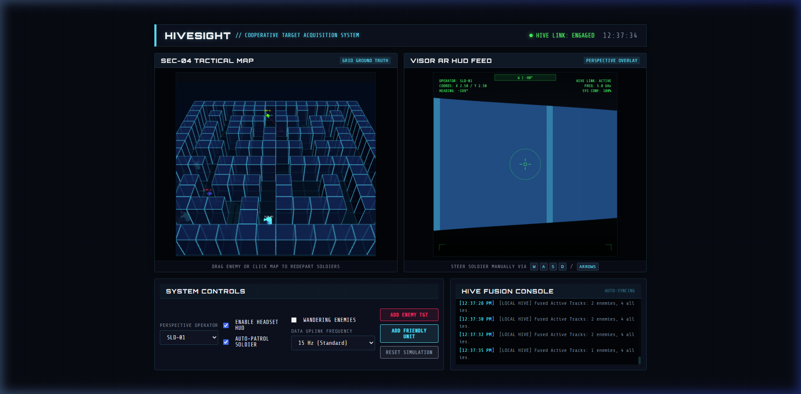
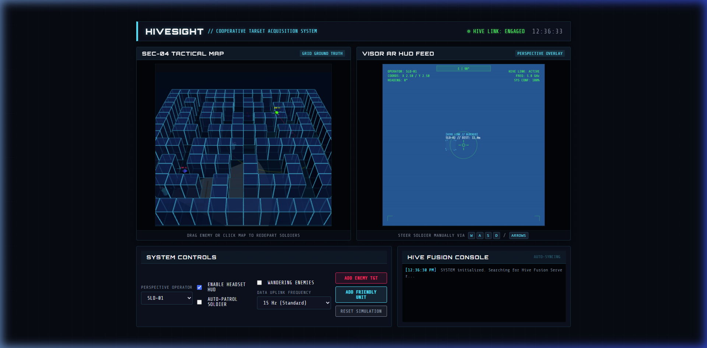

# HiveSight: Tactical Sensory Fusion Simulation Concept

**HiveSight** is a conceptual multi-agent tactical sensor fusion network simulation designed for cooperative infantry and drone operations. 

> [!IMPORTANT]
> **Project Scope Statement**
> This project is a **concept demonstration and simulation only** designed to model and visualize data sharing and sensor fusion ideas. It does not interface with physical hardware, and is built entirely as a software simulation.

The simulation models a scenario where infantry units equipped with AR head-mounted visors and an overhead surveillance drone share target tracking telemetry in real time. If any single friendly entity spots a target, its position is fused by the central server and immediately projected onto the headsets of all other operators—allowing them to see bounding boxes for threats even if they are blocked behind walls.

---

## System Architecture & Features

The simulation runs a distributed client-server model:

1. **Central Hive Mind Backend (`server.py`)**:
   - A zero-dependency Python script serving the static files and running the sensor fusion algorithms.
   - **Clustering Engine**: Groups redundant reports from multiple soldiers or drones observing the same entity (using proximity-based spatial clustering) to output a single fused track.
   - **Track Decay**: Decays track confidence and removes targets when they are no longer observed by any sensors for a threshold period (3.0 seconds).
   
2. **WebGL 3D Holographic Battlefield**:
   - Built using **Three.js** with full orbital camera controls (Left-drag to orbit, Right-drag to pan, Scroll to zoom).
   - Extrudes the urban training grid into 3D holographic structures (glass buildings with glowing neon outlines).
   - Renders 3D cylinders for friendly soldiers (with direction visors and translucent visual arcs), spinning propellers on the drone, and octahedrons for threat points.

3. **3D Raycaster Visor HUD**:
   - Simulates the first-person visor view of the selected operator.
   - If an enemy target is in direct line of sight, the visor renders its silhouette and paints a solid target lock.
   - If a threat is occluded by walls/buildings, the headset queries the Hive Mind track list and projects a **dashed red AR bounding box** through the walls.
   - Toggleable HUD mode allows switching between normal visor vision and digital AR feed.

4. **Interactive Controls & Dragging**:
   - Drag red enemy markers anywhere in 3D space to test sight breaks and watch the Hive Mind link update.
   - Steer manual operators using case-insensitive keyboard controls (`W`,`A`,`S`,`D` or `Arrow Keys`).
   - Switch active visor feeds using the drop-down menu and toggle auto-patrol logic.

---

## Visual Previews

### Holographic City Grid (3D View)
An interactive 3D tactical map showing building boundaries, sight cones, and the drone hover area.


### Tactical Dashboard Layout
The dual-screen layout provides the ground truth city map alongside the operator's visor HUD.


---

## File Structure

All paths and imports are relative, enabling directory relocation:
```bash
HiveSight/
├── screenshots/          # Embedded preview images
│   ├── 3d_map.png
│   └── dashboard.png
├── js/
│   ├── app.js            # Coordinator, event listeners, & mock fallback
│   ├── entity.js         # Soldier, Drone, and Enemy classes & steering AI
│   ├── map.js            # Grid map configuration
│   ├── math.js           # Line-of-sight and polar-to-cartesian formulas
│   └── renderer.js       # WebGL 3D map and 3D raycast visor renderer
├── index.html            # Main dashboard HTML template
├── style.css             # Vanilla CSS UI skin stylesheet
├── server.py             # Python HTTP server and Fusion backend
└── README.md             # Project documentation
```

---

## Quick Start Guide

### Prerequisites
- Python 3.x installed (uses standard library modules: `http.server`, `json`, `math`, `time`, `os`).
- Web Browser (Chrome, Edge, or Firefox).

### Instructions
1. Clone or download this repository.
2. Open a terminal in the root directory (`HiveSight/`).
3. Start the fusion backend server:
   ```bash
   python server.py
   ```
4. Open your web browser and navigate to:
   ```url
   http://localhost:8000/
   ```
5. *(Optional Fallback)*: If the server is offline or not running, the application will automatically activate its built-in JavaScript local mock server so you can still run and inspect the simulation fully offline.